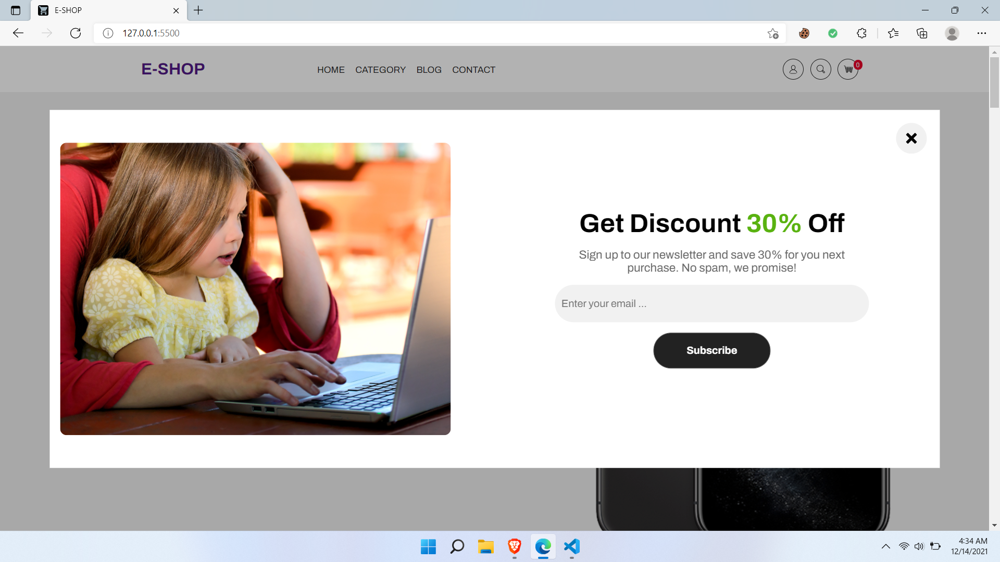
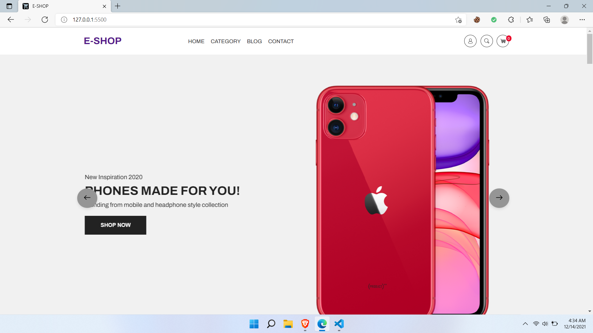
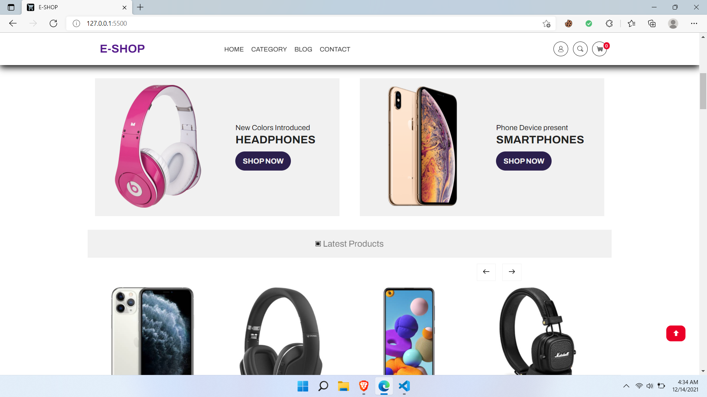
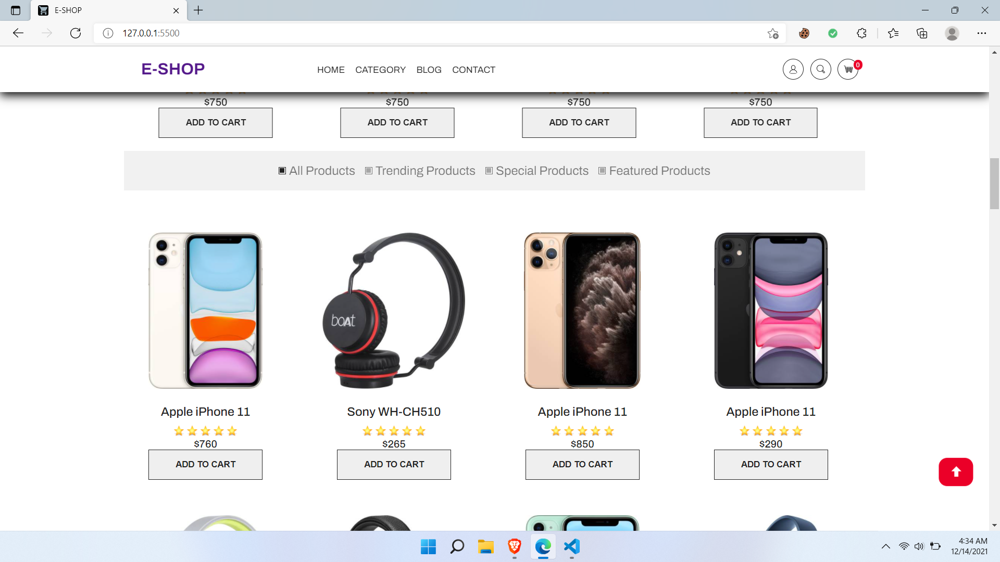
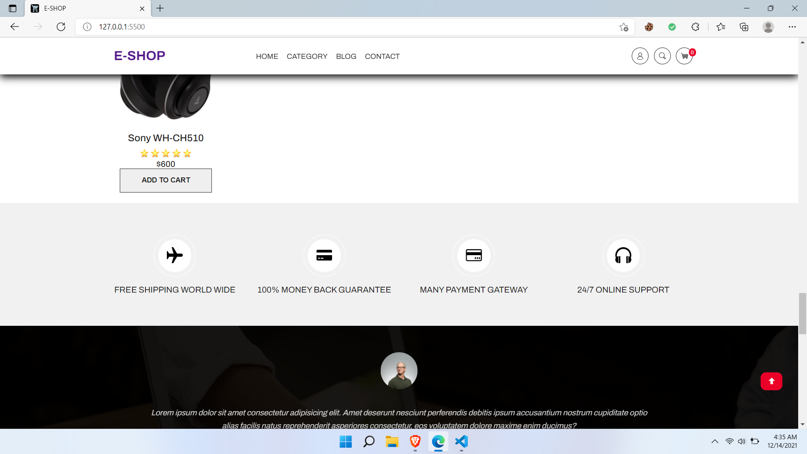
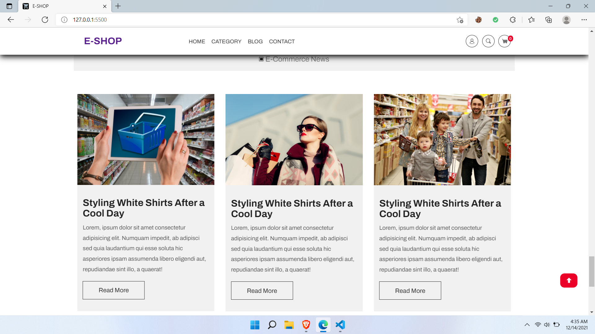
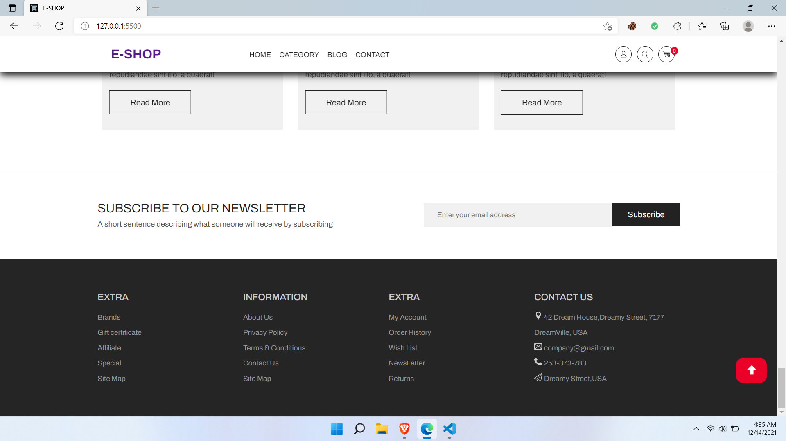

# E-commerce site

# Project Name : E-SHOP 
> Hello Everyone, Welcome to my Repository! This is a fully Responsive e-commerce website.

## Table of Contents
* [General Info](#general-information)
* [Technologies Used](#technologies-used)
* [Features](#features)
* [Screenshots](#screenshots)
* [Setup](#setup)
* [Usage](#usage)
* [Project Status](#project-status)
* [Room for Improvement](#room-for-improvement)
* [Acknowledgements](#acknowledgements)

## General Information
- This is a full responsive e-commerce website.
- These are the advantages of an e-commerce site.
   1. Faster buying process
   2. Store and product listing creation
   3. Cost reduction
   4. Affordable advertising and marketing
   5. Flexibility for customers
   6. No reach limitations
   7. Product and price comparison
   8. Faster response to buyer/market demands
   9. Several payment modes

- This project was made for our Software Engineering and Design Pattern lab course.

## Technologies Used
- HTML5
- CSS
- BOOTSTRAP
- JAVASCRIPT
- NODE JS, etc

## Features
Here are the ready features of this project:
- User-friendly navigation
- Shopping cart
- Search bar
- Text content
- Contact us
- Newsletter signup
- Payment system icons
- Product title
- Good quality of images with zoom in functionality
- Add to cart button
- Awesome Hero area 
- product list
- product filter option
- Latest Product Area
- Product Category
- Pop Up Menu and Go To Top Button
- Awesome Facility Area
- Testimonial
- Blog
- Nice Footer
- Last of all It is fully responsive for all type of device.

## Screenshots

<!-- If you have screenshots you'd like to share, include them here. -->

## Setup
* You have to install vscode on your machine.
* Install live server extension from Extensions
* Install Node Js on your machine and then install npm on the project directory.
* Then Download and open folder on your vscode and start Live server. 

## Project Status
Our Project is : _in progress_. We just made the Front end Part of the project.The BackEnd part is still in working stage.We will update that shortly.

## Room for Improvement

To do:

- Login & Signup page
- Cart page
- connecting Backend with the FrontEnd

## Acknowledgements

- Submission Video [this tutorial](https://www.example.com).
- Many thanks to...My partner Ismahabul Hasan Sizan

